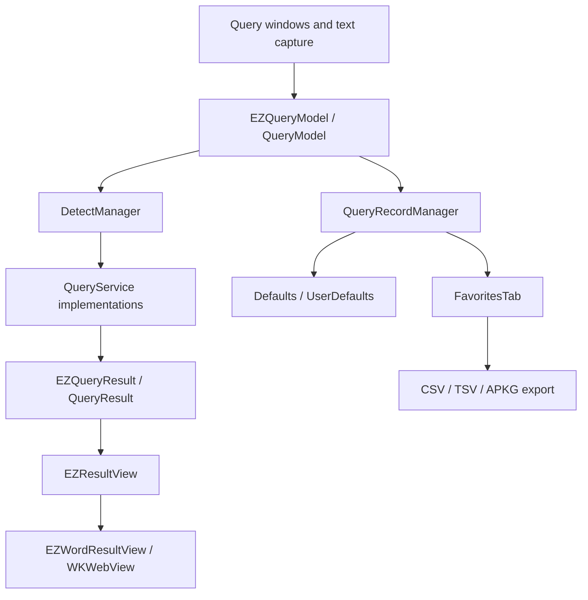

# EasyDict Favorites + Anki Project Analysis

## Architecture

EasyDict is a macOS translation app built with a mixed Swift, SwiftUI, AppKit, and Objective-C architecture.

### Technology Stack

- macOS desktop app.
- AppKit and Objective-C for the query window shell and result rendering container.
- Swift for service models, query services, configuration, and settings features.
- SwiftUI for the settings UI, including the existing Favorites tab.
- `Defaults` wraps `UserDefaults` for lightweight persistent settings and records.
- CocoaPods and Swift Package dependencies are managed through the Xcode workspace.

## Directory Structure

- `Easydict/App`: app entry, assets, Info.plist, localization.
- `Easydict/objc/ViewController`: query windows, title bar, result cells, AppKit views.
- `Easydict/Swift/Model`: shared query models and record models.
- `Easydict/Swift/Service`: translation, dictionary, OCR, and AI services.
- `Easydict/Swift/View/SettingView`: SwiftUI settings tabs.
- `Easydict/Swift/Feature/Configuration`: Defaults keys and app configuration.
- `EasydictTests`: XCTest coverage for utility and service behavior.

## Query Flow

1. The user enters, selects, pastes, or OCRs text in a query window.
2. `EZBaseQueryViewController` normalizes input through `EZQueryModel`.
3. `DetectManager` detects source language and calculates target language.
4. Enabled `QueryService` implementations query services such as Youdao and DeepL.
5. Each service writes into an `EZQueryResult` with fields such as `translatedResults`, `wordResult`, `htmlString`, and `error`.
6. `EZResultView` renders each service block and embeds `EZWordResultView` for text, dictionary, or HTML content.
7. Query text is currently added to history through `QueryRecordManager`.

## Word Data Structure

`EZQueryResult` is the central result object:

- `queryModel`: source query metadata.
- `serviceTypeWithUniqueIdentifier`: service identifier such as Youdao or DeepL.
- `translatedResults`: plain translation result paragraphs.
- `wordResult`: dictionary-style data, including phonetics, parts, simple words, synonyms, antonyms, and etymology.
- `htmlString` / `htmlStrings`: rendered dictionary HTML.

The existing `QueryRecord` stores only query text, source language, target language, and timestamp. It should be extended with optional fields for phonetic, translation, definition, example, and per-service result summaries.

## Local Storage

There is no dedicated database for favorites. The project already stores favorites and query history in `Defaults` keys:

- `EZConfiguration_kFavorites`
- `EZConfiguration_kQueryHistory`

This is the best fit for the first implementation because it is already wired to SwiftUI updates and survives app restarts. File-based export should use user-selected destinations, with suggested names under the PRD's `exports` concept.

## Extension Plan

### Favorite Implementation

- Reuse `QueryRecordManager` as the durable favorite API.
- Extend `QueryRecord` to include PRD-compatible fields: word, phonetic, definition, translation, example, and service results.
- Add a `toggleFavorite(result:)` path that captures the current query and currently available service output.
- Update the title bar quick action to show `☆ Favorite` or `★ Favorited` and toggle immediately.

### Favorites Page

- Upgrade `FavoritesTab` from a basic list to a management page.
- Add search, sort, batch selection, date range filtering, and deletion.
- Show word/query text, phonetic, translation/definition summary, and favorite timestamp.

### Anki Export

- Export selected or filtered favorites as CSV and TSV using `Front` and `Back` columns.
- Generate the back side from a card template:
  - phonetic
  - translation
  - definition
  - example
  - service summaries
- Add lightweight APKG generation without adding heavy dependencies. The implementation can create an Anki SQLite collection and zip it into an `.apkg` package by using system SQLite/zip tools when available.

### Card Templates

- Add a Codable `CardTemplate` model with built-in templates from the PRD.
- Persist custom template selections in app settings later if deeper template editing is needed.
- Use the selected template during export.

### AI Assisted Card Content

- Store optional AI-enriched card fields in the same `QueryRecord` model.
- The first pass should keep the UI and persistence ready for generated content, then connect it to existing AI services in a later iteration so API prompts and cost controls can be reviewed separately.
